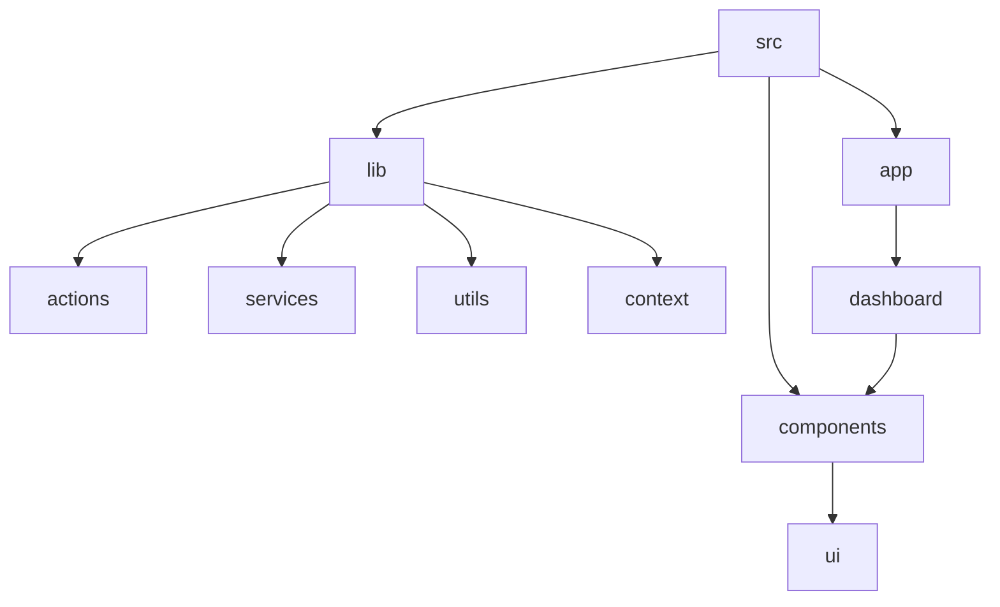
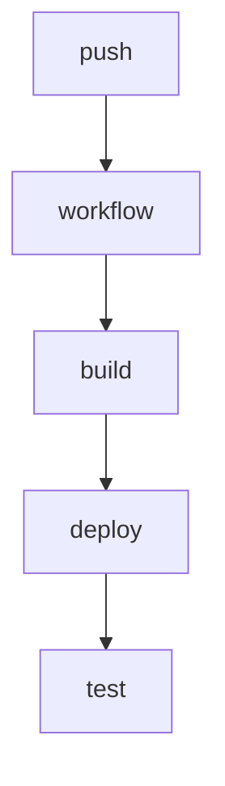

# Paywise: Expense Management and Financial Tracking Platform

## 🗂️ Description

Paywise is a comprehensive expense management and financial tracking platform designed to help individuals and groups manage their finances efficiently. The platform allows users to track personal expenses, manage recurring bills and payments, and split expenses with friends or family. With a focus on user-friendly interfaces and robust functionality, Paywise aims to simplify financial management and provide valuable insights into spending habits.

## ✨ Key Features

### Expense Management
- **Personal Expense Tracking**: Add, view, and manage personal expenses with features like expense description, amount, category, and receipt URL.
- **Recurring Bill Management**: Create, view, and manage recurring bills and payments with customizable frequency and reminders.

### Financial Collaboration
- **Split Management**: Create and manage splits with friends or family, allowing for easy division of expenses and tracking of payments.

### Notifications and Reminders
- **Daily Reminders**: Receive daily reminders for recurring payments and split expenses.
- **Email Notifications**: Automated email notifications for various events, such as split payments and recurring bill due dates.

## 🗂️ Folder Structure

## 🛠️ Tech Stack

## ⚙️ Setup Instructions

### Prerequisites
- Node.js (>=18.0.0)
- npm or yarn
- Git

### Installation
1. Git clone the repository: `git clone https://github.com/ASHUTOSH-SWAIN-GIT/paywise.git`
2. Navigate to the project directory: `cd paywise`
3. Install dependencies: `npm install` or `yarn install`

### Environment Variables
Create a `.env` file in the root directory and add required environment variables as specified in `ENV_CONFIG.md`.

### Running the Application
- Development mode: `npm run dev` or `yarn dev`
- Production build: `npm run build` or `yarn build`

## GitHub Actions

The project utilizes GitHub Actions for automated workflows, including deployment and testing. The workflow files are located in the `.github/workflows` directory.

  

<h3>null</h3>

Software Developer & Competitive Programmer

 

  <a href="https://gitfull.vercel.app">Made by GitFull</a>

    
